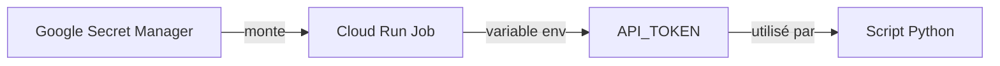
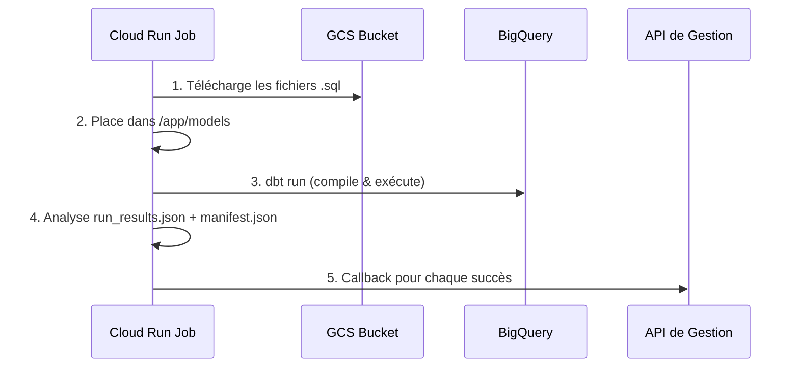
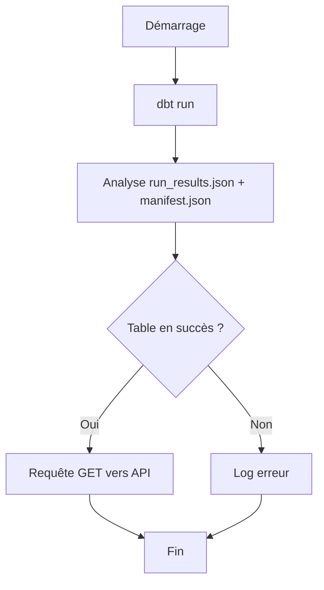

# bq2bq-dbt-docker

> **Documentation Technique** : Projet dbt Cloud Run (Architecture Generic Runner)

Ce document détaille l'architecture technique pour l'ingestion de données BigQuery et la notification d'API via Cloud Run.

---

## 📁 Table des matières

1. [Structure et Logique des Données](#1-structure-et-logique-des-données-dbt--sql)
2. [Gestion des Dépendances](#2-gestion-des-dépendances--environnement-uv)
3. [Sécurité & Authentification API](#3-sécurité--authentification-api-secret-token)
4. [Workflow "Generic Runner"](#4-workflow-generic-runner-download-on-start)
5. [Configuration des Requêtes SQL](#5-configuration-des-requêtes-sql)
6. [Wrapper Python (Orchestrateur)](#6-le-wrapper-python-lorchéstrateur)
7. [Conteneurisation Docker](#7-conteneurisation-docker)
8. [Infrastructure Terraform & Cloud Run](#8-infrastructure-terraform--cloud-run)

---

## 1. Structure et Logique des Données (dbt + SQL)

Au lieu de scripts SQL bruts, nous utilisons **dbt** (data build tool) pour gérer la compilation, l'ordre d'exécution (DAG) et la documentation des requêtes.

| Aspect | Description |
|--------|-------------|
| **Organisation** | Chaque requête de création de table est un fichier `.sql` situé dans le dossier `models/` |
| **Configuration Meta** | Pour lier une table SQL à un paramètre spécifique de l'API de gestion (ex: un ID de dataset), nous utilisons la configuration native de dbt directement dans le fichier SQL |

> [!TIP]
> Plus besoin de fichier CSV externe pour la configuration !

---

## 2. Gestion des Dépendances & Environnement (uv)

Le projet utilise [**uv**](https://github.com/astral-sh/uv) pour la gestion des dépendances Python.

```dockerfile
# Installe les dépendances définies dans uv.lock directement dans l'environnement système du conteneur
RUN uv sync --frozen --no-dev --system
```

| Option | Description |
|--------|-------------|
| `--frozen` | Interdit la mise à jour des versions (respect strict du lockfile) |
| `--no-dev` | N'installe pas les outils de test/dev pour alléger l'image |
| `--system` | Installe dans l'environnement système (pas de virtualenv) |

---

## 3. Sécurité & Authentification API (Secret Token)

L'appel à l'API de gestion (pour notifier la création des tables) est sécurisé par un **Bearer Token statique**.

> [!CAUTION]
> Ce token ne doit **jamais** apparaître en clair dans le code ou les fichiers de configuration.

### Flux de gestion du secret



| Étape | Description |
|-------|-------------|
| **Stockage** | Le token est stocké dans Google Secret Manager (géré par Terraform) |
| **Injection** | Le module Terraform configure le Job Cloud Run pour monter ce secret en tant que variable d'environnement `API_TOKEN` |
| **Source** | Secret Manager (version `latest`) |

### Utilisation dans le Script Python

```python
# Extrait du script
token = os.environ.get("API_TOKEN")
headers = {"Authorization": f"apikey {token}"} if token else {}
```

> [!NOTE]
> Si la variable est vide, le script logue un avertissement mais ne plante pas (sauf si un appel est requis).

---

## 4. Workflow "Generic Runner" (Download-on-Start)

L'architecture sépare le **code d'exécution** (Image Docker) des **requêtes métier** (Fichiers SQL).



### Étapes détaillées

1. **Démarrage & Téléchargement** : Le script Python se connecte au bucket GCS défini par `GCS_BUCKET_NAME` et télécharge l'intégralité du dossier contenant les requêtes `.sql` dans `/app/models`

2. **Exécution dbt** : Le script lance `dbt run`. dbt compile les fichiers SQL téléchargés et exécute les transformations sur BigQuery

3. **Analyse & Callback** : Le script croise les résultats (`run_results.json`) avec la configuration meta (`manifest.json`). Pour chaque succès, il déclenche l'appel API avec le token sécurisé

---

## 5. Configuration des Requêtes SQL

La liaison entre une requête SQL et l'API se fait via la configuration `meta` native de dbt, directement dans le fichier `.sql`.

### Exemple : `models/users.sql`

```sql
{{ config(
    materialized='table',
    meta = {
        "api_trigger_param": "api_param" 
    }
) }}

-- Si api_trigger_param est présent, le script appellera : BASE_URL/api/automation/v1.0/datasets/{api_param}/publish/
SELECT ...
```

---

## 6. Le Wrapper Python (L'Orchestrateur)

Le point d'entrée du conteneur est le script `main.py`.

### Workflow du script



| Étape | Description |
|-------|-------------|
| **Exécution** | Lance `dbt run` |
| **Analyse** | Croise les fichiers `run_results.json` (statuts) et `manifest.json` (configs meta) |
| **Notification** | Requête GET vers l'API de gestion pour chaque table en succès |
| **Authentification** | Bearer Token lu depuis `API_TOKEN` |

---

## 7. Conteneurisation (Docker)

Le projet est packagé dans une image Docker optimisée pour Cloud Run.

---

## 8. Infrastructure (Terraform & Cloud Run)

Le déploiement est géré par un **module Terraform générique**.

### Ressource principale

- **`google_cloud_run_v2_job`** : Contrairement à un "Service", le "Job" est conçu pour des tâches qui ont un début et une fin (pas d'écoute de port HTTP)

### Variables d'environnement

| Variable | Description |
|----------|-------------|
| `API_CALLBACK_URL` | L'URL de base de l'API de gestion |
| `API_TOKEN` | Token d'authentification (injecté depuis Secret Manager) |

### Planification

Un **`google_cloud_scheduler_job`** déclenche le Job Cloud Run à fréquence définie (ex: tous les matins à 6h).

---

## 📂 Structure du projet

```
bq2bq-dbt-docker/
├── src/
│   ├── main.py          # Script orchestrateur Python
│   └── dbt_project.yml  # Configuration dbt
├── Dockerfile           # Image Docker
├── README.md            # Ce fichier
└── ...
```